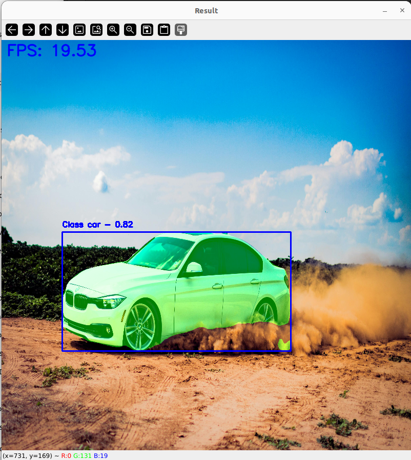

# YOLOv8 Segmentation with End-to-End ONNX Model



This repository provides an end-to-end implementation of YOLOv8 for segmentation. Unlike most implementations available online, this version incorporates **all post-processing directly inside the ONNX model**, from Non-Maximum Suppression (NMS) to mask calculations, making it a true one-stop solution for real-time object detection and segmentation using ONNX. 

### Key Features:
- **End-to-End ONNX Model**: The ONNX model handles all post-processing, including NMS and mask calculation, within the model.
- **Multiple Outputs**:
  - **Bounding Boxes**: Coordinates of the detected objects.
  - **Final Mask**: A mask containing 1 value for every object mask detected in the image.
  - **Individual Masks**: Separate binary masks for each object detected, which can be applied to the image for visualization.


---

## Why This Repository?

There are no complete end-to-end implementations of YOLOv8 segmentation models available online. Most solutions require external post-processing code for tasks such as Non-Maximum Suppression (NMS) and mask generation. This repository addresses that gap by embedding all post-processing steps nto the ONNX model, making it easier to integrate the model into any pipeline.

---

## Setup

### 1. Clone the Repository

```bash
git clone https://github.com/namas191297/yolov8-segmentation-end2end-onnxruntime.git
cd yolov8-segmentation-end2end-onnxruntime
```

### 2. Create a Python Environment

It is recommended to create a virtual environment to manage dependencies.

```bash
# Using conda (preferred)
conda create --name yolov8-segmentation python=3.9
conda activate yolov8-segmentation
```

### 3. Install Required Dependencies

```bash
pip install -r requirements.txt
```

---

### Running the Model

You can run the model using your webcam feed for real-time segmentation.

```bash
python run_webcam.py --model models/yolov8n-640x640-end2end.onnx --input-width 640 --input-height 640
```

You can also run it on a single image:

```bash 
python run_image.py --model models/yolov8n-640x640-end2end.onnx --image assets/pexels-car.jpg --input-width 640 --input-height 640
```

### Additional Arguments

- `--input-width`: The input width for the model (default is 640)
- `--input-height`: The input height for the model (default is 640)

### Model Outputs:
1. **Bounding Boxes**: The coordinates of each detected object.
2. **Final Mask**: A single binary mask containing a value of 1 for all masks detected.
3. **Individual Masks**: Binary masks for each individual object detected.


---

## Model Outputs in Detail

The model provides the following outputs:
1. **Bounding Boxes**: The coordinates (xmin, ymin, xmax, ymax) that enclose each detected object along with class and confidence.
2. **Final Mask**: A single mask representing all detected objects, with one mask per object.
3. **Individual Masks**: Separate masks for each object, making it easy to apply and visualize each object's segmentation.

--- 

## License

This repository uses the YOLOv8 model provided by Ultralytics. Please note that YOLOv8 is licensed under the **GPL-3.0 License**. If you distribute or modify this repository, ensure compliance with the terms of the GPL-3.0 license.

For more details, you can review the license here: [Ultralytics YOLOv8 License](https://github.com/ultralytics/yolov8/blob/main/LICENSE).

---

## Contributions

Contributions are welcome! Feel free to submit issues, fork the repository, and open pull requests.
